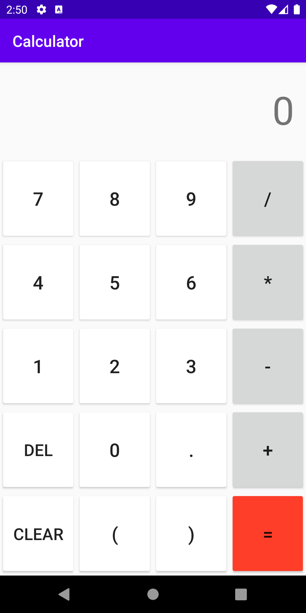

# Expression-calculator
## Description
Calculator app for Android, written using Kotlin and XML in Android Studio. The calculator supports the standard four functions and decimals, as well as parentheses for full expression simplification, and delete and clear buttons. This application was created solely for me to get experience creating Android apps and is not intended for market release.

## Technologies
* Kotlin 1.3
* Android SDK 16-30
* exp4j 0.4.8

## Screenshot

## Sources
Expressions are simplified with the use of the exp4j library at https://www.objecthunter.net/exp4j/
